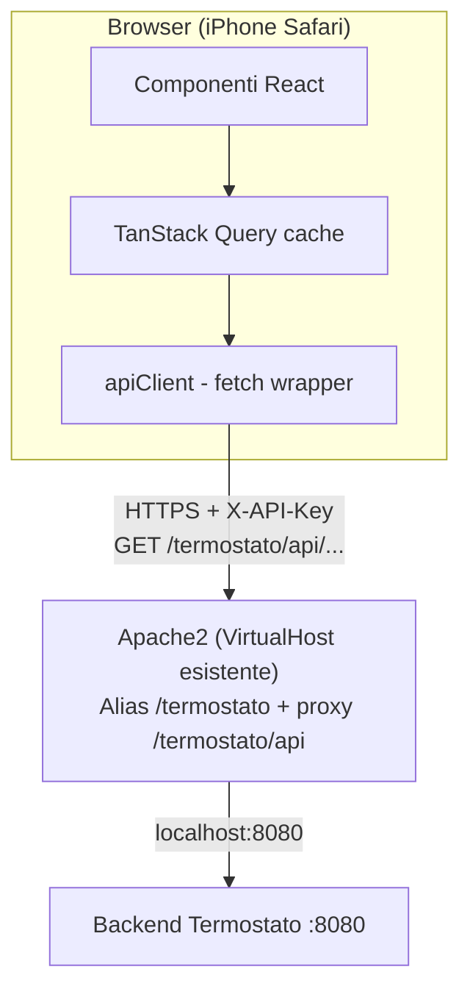

# Specifiche tecniche — Frontend Termostato intelligente

> Documento di progettazione tecnica per l'implementazione della web-app di
> gestione del termostato. Il backend esiste già ed espone i servizi REST
> descritti in [`openapi.yaml`](./openapi.yaml). I requisiti funzionali del
> sistema sono in [`specifiche-funzionali.md`](./specifiche-funzionali.md).

## 1. Obiettivo e ambito

Realizzare una **web-app mobile-first** che permetta di:

1. Visualizzare e modificare la configurazione di sistema (`GET`/`PUT /config`).
2. Visualizzare e modificare il calendario settimanale (`GET`/`PUT /config/calendario`).
3. Consultare i log di polling (`GET /log`) con filtro per range di date.
4. Consultare i log di errore (`GET /log/errori`) con filtro per range di date.
5. (Opzionale) Mostrare lo stato di salute del backend (`GET /actuator/health`).

L'ambito è **esclusivamente il frontend**. Il backend non viene modificato. Il
consumo del contratto REST inbound è quello descritto in `openapi.yaml`; gli
endpoint `mock/*`, `/temperature`, `/relay` non sono usati dal frontend (sono
per lo scenario E2E lato backend).

## 2. Vincoli di contesto

| Vincolo | Origine | Impatto sulla progettazione |
|---|---|---|
| Uso da smartphone, in particolare iPhone | Richiesta utente | Layout mobile-first, test su Safari/WebKit, touch target ≥ 44px, viewport `safe-area-inset` |
| Deploy su Linux con Apache2 + HTTPS funzionante | Richiesta utente | Il frontend è un **bundle statico** servito da Apache; nessun runtime Node in produzione |
| Preferenza per la semplicità | Richiesta utente | Stack minimale, poche dipendenze, nessun backend-for-frontend dedicato |
| Autenticazione via `X-API-Key` | `openapi.yaml`, sez. 3.8 / 7.0 | Vedi capitolo 5 (Sicurezza): il segreto non può risiedere nel bundle |
| JSON in `snake_case` | `openapi.yaml` (info) | Tipi TypeScript con proprietà in snake_case; nessuna conversione automatica |
| Date/orari in UTC | Spec funzionali RF-24/25, `openapi.yaml` | Gestione esplicita UTC ↔ visualizzazione locale (vedi cap. 7) |

## 3. Scelte tecnologiche (con motivazione)

Criterio guida: **semplicità**, poche dipendenze, output statico servibile da Apache.

### 3.1 Stack raccomandato

| Layer | Tecnologia | Motivazione |
|---|---|---|
| Linguaggio | **TypeScript** | Il contratto OpenAPI è ricco e tipizzato; TS previene errori sui nomi snake_case e sui campi nullable |
| Framework UI | **React 18** | Ecosistema ampio, curva nota, ottimo supporto mobile |
| Build tool | **Vite** | Zero-config, build statica velocissima, output = cartella `dist/` di file statici → ideale per Apache |
| Routing | **React Router** | Poche route (config, calendario, log, errori); soluzione standard |
| Data fetching | **TanStack Query (React Query)** | Cache, refetch, gestione loading/error con pochissimo codice; evita di scrivere state management a mano |
| Form | **React Hook Form** + **Zod** | Validazione dichiarativa allineata ai vincoli OpenAPI (min/max, multipleOf 0.1, campi obbligatori) |
| Styling | **Tailwind CSS** | Scelta confermata. Per chi viene dal back-end è il percorso più semplice: utility direttamente nel markup, nessun file CSS da mantenere, mobile-first immediato con i prefissi responsive |
| Grafici | **Recharts** | Visualizzazione grafica dei log (andamento temperatura/target). API dichiarativa React, semplice per grafici a linee; buona resa su mobile |
| Liste lunghe | **react-window** | Virtualizzazione della tabella log di polling (~1440 righe/giorno): renderizza solo le righe visibili, mantiene la UI fluida |
| PWA | **vite-plugin-pwa** | Genera manifest e service worker (Workbox) con configurazione minima; abilita "Aggiungi a Home" su iPhone |
| Client HTTP | **fetch** nativo (wrapper sottile) | Nessuna libreria HTTP aggiuntiva necessaria |
| Tipi API | Generati da OpenAPI con **openapi-typescript** | Tipi sempre allineati al contratto; una sola fonte di verità |

> Nota sulla semplicità: se anche React viene considerato troppo, un'alternativa
> più leggera è **Preact + Vite** (API compatibile React, bundle ~3x più
> piccolo). React resta la raccomandazione per la maturità dell'ecosistema.
>
> Nota sullo styling (profilo back-end): **Tailwind CSS** è consigliato proprio
> per chi conosce poco i framework front-end. Non richiede di scrivere e
> mantenere CSS separato né di ragionare su naming/cascade: si compongono classi
> utility direttamente nel markup e il responsive mobile-first si ottiene con
> prefissi come `sm:`/`md:`. Riduce al minimo le decisioni di design.

### 3.2 Alternative valutate e scartate

- **Next.js / SSR**: introduce un runtime server (Node) in produzione. Non
  necessario e in contrasto con "bundle statico su Apache". Scartato.
- **Angular**: valido ma più verboso e con più boilerplate del necessario per
  ~4 schermate. Scartato per semplicità.
- **Vanilla JS senza framework**: massimizza la semplicità delle dipendenze ma
  richiede di scrivere a mano data-binding, validazione e fetch state; per la
  quantità di form (config + calendario) il costo cresce. Scartato.

### 3.3 Tooling di sviluppo

- **Node.js** (LTS) solo in fase di sviluppo/build (mai in produzione).
- **ESLint** + **Prettier** per qualità e formattazione.
- **Vitest** + **Testing Library** per unit/component test.
- **Playwright** (opzionale) per E2E su almeno un flusso critico (modifica config).

## 4. Architettura del frontend



### 4.1 Struttura delle cartelle proposta

```
src/
  main.tsx                 # bootstrap React
  App.tsx                  # router + layout
  api/
    generated.ts           # tipi generati da openapi.yaml (openapi-typescript)
    client.ts              # wrapper fetch: base URL, header X-API-Key, gestione errori/401
    config.ts              # funzioni getConfig / updateConfig
    calendar.ts            # funzioni getCalendar / updateCalendar
    logs.ts                # funzioni getPollingLogs / getErrorLogs
  auth/
    apiKeyStore.ts         # lettura/scrittura/rimozione chiave in localStorage
    ApiKeyGate.tsx         # gate: mostra inserimento chiave se assente/non valida
    useApiKey.ts           # hook per accedere/aggiornare la chiave
  hooks/
    useConfig.ts           # React Query hooks
    useCalendar.ts
    useLogs.ts
  pages/
    ConfigPage.tsx
    CalendarPage.tsx
    LogsPage.tsx
    ErrorLogsPage.tsx
    SettingsPage.tsx       # gestione API-key (inserimento/sostituzione/reset)
  components/
    forms/                 # campi form riutilizzabili (temperatura, orario, ecc.)
    layout/                # header, bottom nav mobile, safe-area wrapper
    common/                # spinner, toast, empty-state
  lib/
    datetime.ts            # helper UTC <-> locale
    validation.ts          # schemi Zod allineati a OpenAPI
  styles/
```

### 4.2 Layer di accesso ai dati

- `api/client.ts` centralizza: base URL, header `X-API-Key` (vedi cap. 5),
  serializzazione JSON, parsing risposte, mappatura degli errori (`ApiError`,
  `UnauthorizedError`) in un formato uniforme per la UI.
- I tipi TypeScript sono **generati** da `openapi.yaml` così da restare allineati
  al contratto (comando in `package.json`, es. `openapi-typescript openapi.yaml -o src/api/generated.ts`).
- Ogni endpoint ha una funzione dedicata + un hook React Query per cache,
  stato di caricamento e invalidazione dopo le `PUT`.

## 5. Sicurezza e gestione della API-key

Il backend richiede l'header `X-API-Key` su **tutti** gli endpoint e la lista
`api_keys` è fail-closed. Una SPA statica **non può custodire un segreto**: tutto
ciò che finisce nel bundle o nel browser è ispezionabile dall'utente.

**Soluzione adottata: la chiave viene inserita dall'utente e salvata nel
browser.** Il frontend non contiene alcuna chiave nel bundle; è l'utente a
fornirla la prima volta, e il client la aggiunge all'header `X-API-Key` di ogni
richiesta.

Questa scelta è adeguata a un contesto **personale/domestico**, in cui l'app è
usata da un numero ristretto di dispositivi fidati (l'iPhone del proprietario) e
il livello di rischio accettato è coerente con la semplicità richiesta.

### 5.1 Comportamento funzionale

1. **Primo accesso / chiave assente**: se in `localStorage` non è presente una
   chiave valida, l'app mostra una schermata (o modale) di **inserimento
   API-key** prima di consentire l'accesso alle altre funzionalità.
2. **Persistenza**: la chiave viene salvata in `localStorage` (chiave
   dedicata, es. `termostato.apiKey`). Sopravvive alla chiusura del browser e al
   riavvio del dispositivo, così l'utente non deve reinserirla ogni volta —
   utile per l'uso da iPhone con "Aggiungi a Home".
3. **Uso**: `api/client.ts` legge la chiave dallo storage e la aggiunge
   all'header `X-API-Key` di ogni chiamata.
4. **Gestione `401`**: se una richiesta risponde `401 Unauthorized` (chiave
   mancante, vuota o non più valida), il client:
   - considera la chiave salvata come non valida,
   - la rimuove (o la marca come invalida) dallo storage,
   - reindirizza l'utente alla schermata di inserimento chiave con un messaggio
     esplicito ("API-key non valida o non autorizzata").
5. **Reset manuale**: nella schermata "Impostazioni" l'utente può cancellare o
   sostituire la chiave salvata (utile in caso di rotazione delle `api_keys`).

### 5.2 Compromessi accettati (da dichiarare esplicitamente)

- La chiave è **leggibile in chiaro** nel browser (dev tools, `localStorage`):
  non è un segreto server-side. Accettabile solo per uso personale su dispositivi
  fidati.
- Chiunque abbia accesso fisico/sbloccato al dispositivo può leggere la chiave.
- `localStorage` non è isolato da eventuale codice JavaScript malevolo iniettato
  nella pagina: per questo è essenziale una **Content-Security-Policy** rigorosa
  (vedi 5.4) e servire solo asset propri.

### 5.3 Connessione al backend (CORS)

Poiché il frontend parla direttamente con il backend inviando l'header, occorre
garantire lo **stesso origin** per evitare problemi CORS. Si mantiene Apache come
**reverse proxy** verso il backend (senza iniettare alcuna chiave), così browser
e API condividono l'origin HTTPS del sito.

Dato che l'app è pubblicata in **sotto-cartella** (`https://sliverd.ddns.net/termostato`,
vedi cap. 10), anche il proxy API vive sotto lo stesso prefisso: il frontend usa
come base URL **`/termostato/api`** e Apache proxa quel path verso il backend.
Questo evita ogni collisione con il sito già presente sulla home del dominio.
L'header `X-API-Key` fornito dall'utente viene inoltrato invariato al backend.
La configurazione Apache completa è nel cap. 10.2.

### 5.4 Altre misure

- Servire tutto **solo su HTTPS** (già disponibile) — la chiave viaggia
  cifrata sul canale.
- Header di sicurezza consigliati via Apache: `Content-Security-Policy` rigorosa
  (limita gli origin degli script), `X-Content-Type-Options: nosniff`,
  `Referrer-Policy: no-referrer`.
- Nessun log della chiave lato client (né console, né telemetria).
- Il campo di inserimento chiave usa `type="password"` e `autocomplete="off"`
  per evitare esposizione a schermo e archiviazioni indesiderate.

## 6. Funzionalità e schermate

All'avvio l'app applica un **gate sulla API-key** (`ApiKeyGate`): se non è
presente una chiave in `localStorage`, mostra la schermata di inserimento chiave
(vedi 6.6) prima di ogni altra funzionalità.

Navigazione mobile con **bottom navigation** a 5 voci: Config, Calendario, Log,
Errori, Impostazioni. Un badge/indicatore di stato backend (health) nell'header.

### 6.1 Schermata Configurazione (`/config`)

- Carica con `GET /config`, salva con `PUT /config`.
- Form con validazione allineata a `SystemConfiguration`:
  - `soglia_attivazione`: number ≥ 0, step 0.1.
  - `override_attivo`: toggle. Se true → `temperatura_override` **obbligatorio**
    (Zod: refinement), altrimenti campo disabilitato/null.
  - `intervallo_polling_secondi`: intero ≥ 1.
  - `max_errori_consecutivi`: intero ≥ 1.
  - `retention_log_giorni`: intero ≥ 1.
  - `ntfy_url`, `sensore_url`, `relay_url`: URI non vuoti.
  - `ntfy_topic`: stringa non vuota.
  - `debug_mode`: toggle.
  - `api_keys`: editor di lista di stringhe (aggiungi/rimuovi), `uniqueItems`.
  - `database_path`: **read-only** in UI (bootstrap-only; va rispedito invariato
    nel `PUT`). Mostrare nota "modificabile solo al riavvio".
- La `PUT /config` richiede l'oggetto completo → il form deve reinviare **tutti**
  i campi letti, non solo quelli modificati (merge sullo stato caricato).
- Gestione `400` → mostrare `message` dell'`ApiError`.

### 6.2 Schermata Calendario (`/config/calendario`)

- Carica con `GET /config/calendario`, salva con `PUT /config/calendario`.
- Struttura: 7 giorni canonici (`lunedi`…`domenica`), ciascuno con lista di
  intervalli (`ora_inizio`, `ora_fine`, `temperatura_target`).

**Volume atteso.** Ogni giorno ha **almeno 4 intervalli** (e potenzialmente di
più). Mostrare tutti i 7 giorni con tutti gli slot inline satura lo schermo del
telefono: la schermata usa un layout **ad accordion**.

- **Layout ad accordion (un giorno alla volta)**: i 7 giorni sono righe
  espandibili. La riga collassata mostra nome del giorno e un riepilogo (numero
  di intervalli, es. "4 intervalli"). Toccando il giorno si espande la lista
  completa dei suoi intervalli con l'editor.
- Il giorno **corrente** è espanso di default; gli altri sono collassati.
- **Editor per giorno** (giorno espanso): elenco degli intervalli, ciascuno con
  campi `ora_inizio`/`ora_fine` (`HH:mm`) e `temperatura_target` (step 0.1),
  azione **rimuovi** per intervallo e **"+ Aggiungi intervallo"** in fondo al
  giorno. Gli intervalli sono ordinati per ora di inizio.
- Validazioni lato client (per evitare `400` evitabili):
  - `ora_inizio` < `ora_fine`.
  - Intervalli dello stesso giorno **non sovrapposti** (evidenziare in rosso
    l'intervallo in conflitto).
  - Orari nel formato `HH:mm` (rientra nel pattern accettato dal backend).
  - `temperatura_target` con una cifra decimale.
- **Fuso orario**: l'utente edita e vede gli orari in **ora locale** (Italia
  UTC+1/UTC+2 con DST automatico); il front-end converte in UTC prima del `PUT`
  e da UTC a locale in `GET` (vedi cap. 7). Il payload sul filo resta in UTC.
- **Salvataggio**: un unico pulsante "Salva" persiste l'intero calendario. Il
  `PUT` deve contenere **esattamente i 7 giorni**; i giorni senza intervalli
  vanno inviati come array vuoti.
- Suggerimento UX: azione rapida **"Copia su altri giorni"** per replicare gli
  intervalli di un giorno su altri (comodo con 4+ slot ripetuti nella settimana).

### 6.3 Schermata Log di polling (`/log`)

- `GET /log?da=&a=` con parametri opzionali (`format: date`, UTC).
- Default senza parametri → giorno corrente UTC (gestito dal backend).
- Filtro con due date-picker (`da`, `a`); validazione client `da <= a`.

**Volume dati.** Il backend scrive un record **ad ogni ciclo di polling** (con
polling a 60 s → ~1440 record al giorno). Un elenco a card per singolo record è
inadatto: la vista primaria è il **grafico**; il dettaglio riga è opzionale e in
forma di **tabella compatta**.

- **Visualizzazione grafica (vista primaria, richiesta)**: un **grafico a linee**
  (Recharts) mostra l'andamento nel tempo di:
  - `temperatura_rilevata` (linea continua),
  - `temperatura_target` (linea tratteggiata; assente/gap quando `null`),
  - lo stato caldaia (`caldaia_accesa`) come banda/area di sfondo o marcatori
    ON/OFF, per correlare accensioni e temperatura.
  Il grafico usa lo stesso range di date del filtro (`da`/`a`) e l'asse tempo è
  in **ora locale** (vedi cap. 7). Su dataset ampi (giorni multipli) i punti
  vengono campionati/aggregati per mantenere la resa fluida su mobile.
- **Dettaglio (tabella compatta, nascosta di default)**: la vista mostra di
  **default solo il grafico**. Il dettaglio riga-per-riga è disponibile tramite
  un pulsante **"Mostra dettaglio"** che espande una **tabella densa** (non card)
  con header e scroll verticale. Colonne: ora (locale, `HH:mm`), stato caldaia
  (icona/colore), rilevata, target.
- Accorgimenti per il volume (quando la tabella è espansa):
  - Ordinamento di default per timestamp **decrescente** (voci più recenti in
    cima), configurabile.
  - **Virtualizzazione** della lista (react-window) per non renderizzare 1440
    righe in DOM contemporaneamente.
  - Campi `override_attivo` e `temperatura_override`, poco utili riga-per-riga ad
    alta frequenza, sono consultabili aprendo la singola riga (dettaglio) e non
    occupano colonne fisse.

### 6.4 Schermata Log di errore (`/log/errori`)

- `GET /log/errori?da=&a=`, stessa semantica di `/log`.
- Ogni record: data/ora, `tipo_errore`, caldaia (nullable), temperatura rilevata
  (nullable), `num_errori_consecutivi`.
- Evidenziare visivamente la severità (colore) e il conteggio consecutivo.

### 6.5 Stato backend (opzionale)

- `GET /actuator/health` per un indicatore UP/DOWN nell'header.

### 6.6 Schermata Impostazioni / API-key (`/settings`)

- Mostra lo stato corrente della chiave (impostata / non impostata), senza mai
  rivelarla in chiaro (es. solo ultimi caratteri mascherati).
- **Inserimento/sostituzione chiave**: campo `type="password"`,
  `autocomplete="off"`; al salvataggio la chiave va in `localStorage`.
- **Rimozione chiave**: pulsante che cancella la chiave dallo storage e riporta
  al gate di inserimento.
- Questa schermata è anche la destinazione del **redirect automatico su `401`**
  (chiave mancante/non valida), con messaggio esplicativo.
- All'inserimento è consigliata una **verifica** immediata della chiave con una
  chiamata leggera (es. `GET /actuator/health` o `GET /config`): se risponde
  `401`, la chiave è rifiutata e non viene salvata come valida.

## 7. Gestione di data e ora (UTC ↔ ora locale)

- Il back-end tratta, memorizza e restituisce **tutti** gli orari e i timestamp
  esclusivamente in **UTC** (spec. funzionali RF-40). Il front-end è
  responsabile della conversione nell'**ora locale** del dispositivo in
  visualizzazione e della riconversione in UTC prima dell'invio (RF-41).
- Per un utente in Italia l'offset è **UTC+1** in ora solare e **UTC+2** in ora
  legale (CEST). La conversione deve seguire automaticamente il cambio DST.
- Il formato orario mostrato ed editato è **`HH:mm`** (RF-42).
- **Regole di progettazione:**
  - Tutte le richieste inviano date/orari in UTC; tutte le risposte sono
    interpretate come UTC.
  - I timestamp dei record (`data_ora`, formato `date-time`) vengono
    **visualizzati** convertiti nel fuso locale del dispositivo. Opzionale un
    toggle "mostra UTC" per debug.
  - Gli orari del **calendario** vengono **editati in ora locale** dall'utente
    (più intuitivo) e convertiti in UTC prima del `PUT`; in `GET` si esegue la
    conversione inversa da UTC a locale. Va gestito il caso in cui la conversione
    faccia attraversare la mezzanotte (es. `23:30` locale → giorno/valore UTC
    diverso): mostrare l'informazione in modo chiaro.
  - Centralizzare le conversioni in `lib/datetime.ts`. L'offset non va
    hard-codato: usare il fuso del dispositivo (o un fuso configurato) così che
    il passaggio ora legale/solare sia gestito automaticamente.
  - Preferire l'API nativa `Intl.DateTimeFormat` con `timeZone` esplicito; se le
    conversioni con DST risultano complesse, valutare una libreria leggera
    (es. `date-fns-tz`) — resta comunque una dipendenza opzionale.
  - Attenzione WebKit/Safari: evitare il parsing di stringhe date non standard;
    usare formati ISO 8601 con `Z`.

## 8. Requisiti non funzionali del frontend

| ID | Requisito |
|---|---|
| FE-NF-01 | Layout mobile-first, ottimizzato per iPhone (Safari), touch target ≥ 44px, supporto `safe-area-inset` (notch) |
| FE-NF-02 | Build produce un bundle **statico** servibile da Apache, senza runtime server |
| FE-NF-03 | Tutte le chiamate su **HTTPS**; nessun contenuto misto |
| FE-NF-04 | Nessuna API-key presente nel bundle; la chiave è fornita dall'utente e salvata in `localStorage` (vedi cap. 5) |
| FE-NF-05 | Tipi TS generati dal contratto OpenAPI, mantenuti in sync |
| FE-NF-06 | Gestione esplicita di loading, errore e stato vuoto in ogni schermata |
| FE-NF-07 | Gestione uniforme del `401` → invalidazione chiave salvata e redirect alla schermata Impostazioni; `400`/`500` → mostrare `message` |
| FE-NF-08 | Naming JSON in **snake_case** rispettato senza conversioni implicite |
| FE-NF-09 | Accessibilità di base (label sui campi, contrasto, focus visibile) |
| FE-NF-10 | **PWA richiesta**: manifest + icone + service worker per "Aggiungi a Home" su iPhone e avvio in modalità standalone |
| FE-NF-11 | La chiave non deve mai comparire nei log applicativi né essere mostrata in chiaro in UI |
| FE-NF-12 | **Visualizzazione grafica richiesta** dei log di polling (andamento temperatura rilevata/target e stato caldaia) |

## 9. Mappatura endpoint → funzionalità

| Endpoint (OpenAPI) | Metodo | Uso nel frontend |
|---|---|---|
| `/config` | GET | Caricamento form configurazione |
| `/config` | PUT | Salvataggio configurazione (oggetto completo) |
| `/config/calendario` | GET | Caricamento editor calendario |
| `/config/calendario` | PUT | Salvataggio calendario (7 giorni completi) |
| `/log` | GET | Lista log polling con filtro `da`/`a` |
| `/log/errori` | GET | Lista log errori con filtro `da`/`a` |
| `/actuator/health` | GET | Indicatore stato backend (opzionale) |
| `mock/*`, `/temperature`, `/relay` | — | **Non usati** dal frontend |

## 10. Build e deploy su Apache

Contesto: il server Apache2 ospita **già altri siti**. Va evitato ogni conflitto
di path/configurazione con gli host esistenti.

### 10.0 Modello di pubblicazione (decisione)

**Soluzione adottata: pubblicazione in sotto-cartella** dell'host esistente:

```
https://sliverd.ddns.net/termostato
```

La home di `sliverd.ddns.net` punta già a un altro sito e il dominio è dinamico
(DDNS), quindi un sottodominio dedicato non è pratico. L'app vive perciò sotto il
path `/termostato`, affiancata al sito esistente sullo stesso VirtualHost.

Implicazioni tecniche (tutte gestite dalla configurazione sotto):
- Vite: `base: '/termostato/'` — gli asset sono referenziati con quel prefisso.
- React Router: `basename="/termostato"` — le route SPA vivono sotto il path.
- Base URL API del client: **`/termostato/api`** (proxy sotto lo stesso prefisso,
  così non collide con eventuali `/api` di altri siti).
- PWA/Service Worker: **scope limitato** a `/termostato/` (vedi cap. 13).
- Fallback SPA limitato al path `/termostato` per non interferire con la home.

### 10.1 Build

- In `vite.config.ts` impostare `base: '/termostato/'`.
- Configurare React Router con `basename="/termostato"`.
- Configurare il client API con base URL `/termostato/api`.
- `vite-plugin-pwa`: impostare `scope: '/termostato/'` e `base: '/termostato/'`.
- `npm run build` (Vite) → genera `dist/` con `index.html` + asset con hash +
  artefatti PWA (`manifest.webmanifest`, service worker), tutti con prefisso
  `/termostato/`.

### 10.2 Deploy (sotto-cartella nel VirtualHost esistente)

1. Copiare il contenuto di `dist/` in `/var/www/termostato-fe` sul server.
2. Abilitare i moduli richiesti: `a2enmod proxy proxy_http headers rewrite`.
3. Aggiungere al VirtualHost HTTPS **già esistente** (quello che serve la home)
   i seguenti blocchi, senza toccare la configurazione della home:

```apache
# --- App Termostato pubblicata sotto /termostato ---

# Mappa l'URL /termostato alla cartella dei file statici
Alias /termostato /var/www/termostato-fe

<Directory /var/www/termostato-fe>
    Options -Indexes
    AllowOverride None
    Require all granted

    # Fallback SPA limitato a questa sotto-cartella:
    # le route lato client (es. /termostato/config) tornano all'index dell'app
    RewriteEngine On
    RewriteBase /termostato/
    RewriteCond %{REQUEST_FILENAME} !-f
    RewriteCond %{REQUEST_FILENAME} !-d
    RewriteRule . /termostato/index.html [L]
</Directory>

# Proxy stesso-origin verso il backend sotto lo stesso prefisso.
# L'header X-API-Key del client viene inoltrato invariato (nessuna iniezione).
# Nota: ProxyPass va posto PRIMA dell'Alias nella valutazione; in pratica
# dichiararlo prima evita che l'Alias catturi /termostato/api.
<Location /termostato/api/>
    ProxyPass        http://127.0.0.1:8080/
    ProxyPassReverse http://127.0.0.1:8080/
</Location>

# Header di sicurezza (limitati a questa sotto-cartella)
<Location /termostato>
    Header always set X-Content-Type-Options "nosniff"
    Header always set Referrer-Policy "no-referrer"
</Location>

# Il service worker non deve essere cachato a lungo
<Files "sw.js">
    Header set Cache-Control "no-cache"
</Files>
```

> Ordine di valutazione: perché `/termostato/api` sia proxato al backend e **non**
> servito come file statico dall'`Alias`, il blocco `ProxyPass` deve avere
> precedenza. In Apache i `ProxyPass` in un contesto `<Location>` vengono valutati
> prima degli `Alias`; in caso di dubbi, si può escludere esplicitamente il path
> con `ProxyPass /termostato/api ...` in cima e/o `Alias` senza trailing slash.
> Verificare con `curl` che `GET /termostato/api/config` raggiunga il backend.

4. HTTPS già presente sul VirtualHost esistente: l'app eredita automaticamente il
   certificato del dominio, nessun certificato aggiuntivo necessario.

### 10.3 Caching

- Gli asset con hash (sotto `/termostato/assets/…`) possono avere `Cache-Control`
  lungo (immutable).
- `index.html` e il **service worker** devono avere `Cache-Control: no-cache`
  per servire sempre la versione aggiornata ed evitare PWA "bloccate" su una
  build vecchia.

## 11. Testing

- **Unit/Component** (Vitest + Testing Library): validazioni form (override
  obbligatorio, sovrapposizione intervalli, `da <= a`), rendering card log,
  gate API-key (chiave assente → inserimento; `401` → invalidazione + redirect).
- **Contract**: test che i tipi generati corrispondano al contratto (rigenerazione
  in CI e diff).
- **E2E** (Playwright, opzionale): flusso "leggi config → modifica soglia →
  salva → ricarica" contro un backend con profilo `mock`.
- Test manuale su **Safari iOS** reale per layout, safe-area e date.

## 12. Decisioni consolidate (ex punti aperti)

1. **Strategia API-key**: DECISA → chiave inserita dall'utente e salvata nel
   browser (`localStorage`), con schermata Impostazioni e gate di inserimento
   (cap. 5). CORS risolto mantenendo Apache come reverse proxy stesso-origin che
   inoltra l'header.
2. **Percorso di pubblicazione**: DECISO → **sotto-cartella** dell'host esistente,
   `https://sliverd.ddns.net/termostato`. Vite `base: '/termostato/'`, router
   `basename="/termostato"`, base URL API `/termostato/api`, scope PWA
   `/termostato/` (cap. 10.0). Nessun DNS/certificato aggiuntivo: eredita quello
   del dominio.
3. **Styling**: DECISO → **Tailwind CSS** (semplicità per profilo back-end,
   cap. 3.1).
4. **PWA**: DECISA → installabile "Aggiungi a Home" su iPhone via
   `vite-plugin-pwa` (cap. 3.1 e FE-NF-10).
5. **Visualizzazione grafica dei log**: DECISA → grafico a linee (Recharts) su
   temperatura rilevata/target e stato caldaia (cap. 6.3 e FE-NF-12).

## 13. Note di implementazione PWA

- Configurare `vite-plugin-pwa` con `registerType: 'autoUpdate'` per aggiornare
  il service worker senza intervento manuale.
- **Scope in sotto-cartella**: impostare `base: '/termostato/'` e
  `scope: '/termostato/'`; nel manifest `start_url: '/termostato/'`. Lo scope del
  service worker resta così confinato all'app e non interferisce con la home del
  dominio.
- **Manifest**: `name`, `short_name`, `display: 'standalone'`, `theme_color`,
  `background_color`, icone (almeno 192px e 512px, più icona maskable).
- **iOS/Safari**: aggiungere i meta tag `apple-mobile-web-app-capable`,
  `apple-mobile-web-app-status-bar-style` e i link `apple-touch-icon`; iOS ha un
  supporto PWA parziale, quindi verificare l'installazione reale da Safari.
- Rispettare le regole di caching del service worker (cap. 10.3) per evitare
  build bloccate.
- Attenzione: la PWA **cacha asset statici**, non deve cachare le risposte API di
  configurazione/log (dati sempre freschi) — configurare le runtime caching rules
  di Workbox di conseguenza (network-first o no-cache per `/termostato/api`).
